| Title             | Transient Denial of Service Vulnerabilities in Unisoc Tanggula T760/T8100's 5G Baseband |
| ----------------- | --------------------------------------------------------------------------------------- |
| Affected Product  | Unisoc Tanggula T760/T8100 system-on-chip (SoC) with integrated 5G baseband             |
| Affected Firmware | `5G_MODEM_V2_23B_W24.33.5_P16.1` (older versions may also be affected)                  |
| CVE IDs           | [CVE-2025-31717](https://www.cve.org/CVERecord?id=CVE-2025-31717), [CVE-2025-31718](https://www.cve.org/CVERecord?id=CVE-2025-31718), [CVE-2025-11131](https://www.cve.org/CVERecord?id=CVE-2025-11131), [CVE-2025-11132](https://www.cve.org/CVERecord?id=CVE-2025-11132), [CVE-2025-11133](https://www.cve.org/CVERecord?id=CVE-2025-11133), <br> [CVE-2025-3012](https://www.cve.org/CVERecord?id=CVE-2025-3012), [CVE-2025-61617](https://www.cve.org/CVERecord?id=CVE-2025-61617), [CVE-2025-61618](https://www.cve.org/CVERecord?id=CVE-2025-61618), [CVE-2025-61619](https://www.cve.org/CVERecord?id=CVE-2025-61619), [CVE-2025-61607](https://www.cve.org/CVERecord?id=CVE-2025-61607), <br> [CVE-2025-61608](https://www.cve.org/CVERecord?id=CVE-2025-61608), [CVE-2025-61609](https://www.cve.org/CVERecord?id=CVE-2025-61609), [CVE-2025-61610](https://www.cve.org/CVERecord?id=CVE-2025-61610), [CVE-2025-61612](https://www.cve.org/CVERecord?id=CVE-2025-61612), [CVE-2025-61613](https://www.cve.org/CVERecord?id=CVE-2025-61613), <br> [CVE-2025-61614](https://www.cve.org/CVERecord?id=CVE-2025-61614), [CVE-2025-61615](https://www.cve.org/CVERecord?id=CVE-2025-61615), [CVE-2025-61616](https://www.cve.org/CVERecord?id=CVE-2025-61616), [CVE-2025-69278](https://www.cve.org/CVERecord?id=CVE-2025-69278), [CVE-2025-69279](https://www.cve.org/CVERecord?id=CVE-2025-69279) |
| Vendor Website    | [https://www.unisoc.com](https://www.unisoc.com)                                        |
| Identified in     | June - July 2025                                                                        |
| Identified by     | IoT Lab, University of Applied Sciences Upper Austria, Campus Hagenberg                 |
| Website           | [https://www.fh-ooe.at/si/](https://www.fh-ooe.at/si/)                                  |
| Team              | Denis Krämer B.Sc., Dieter Vymazal M.Sc., DI Markus Zeilinger                           |
| Contact           | Denis Krämer <br> <denis.kraemer@students.fh-hagenberg.at> <br> 7B5B 5FCD 14A2 4A20 C43A A6D0 8B78 FC61 E205 BE39 |

## Vendor Description

*"UNISOC is a globally leading chip design company specializing in the communication semiconductor industry for over 20 years. It possesses comprehensive capabilities in chip design, wireless communication, and the integration of hardware and software systems [...]."*

Source: [https://www.unisoc.com/en/about/company-info](https://www.unisoc.com/en/about/company-info)

## Overview

During the 5G NR initial attachment procedure, unauthenticated radio resource control (RRC) messages are used to set up a connection between the baseband and a base station (gNB) of the 5G mobile network. By modifying downlink RRC setup messages in a specific manner, several reachable assertions in the baseband firmware of the Unisoc Tanggula T760 (rebranded as T8100) can be triggered, each of which result in a silent panic and restart of the modem. Consequently, the mobile network connection of the Motorola Moto G35 5G smartphone (which uses this SoC) becomes temporarily unavailable, and the modem keeps restarting until the transmission of the modified RRC packets via the gNB is stopped. This classifies each of the vulnerabilities as transient DoS.

## Impact

An attacker can use a malicious gNB to send modified RRC setup messages to nearby Unisoc basebands and continuously trigger a modem reset, which results in a loss of mobile network connectivity for these subscribers until the attack is stopped. The attack requires no knowledge of any confidential information stored on the universal integrated circuit cards (UICCs) of the targets, because the RRC setup message is sent by the network to the baseband before any mutual authentication (5G-AKA) is performed. Only the mobile country code (MCC) and mobile network code (MNC) of the target's network is required to successfully execute such an attack. Since the [ITU-T assigns and publishes the MCC/MNC of public networks](http://handle.itu.int/11.1002/pub/82153a48-en), and only a handful of them exist per country, we argue that this requirement adds little complexity to the attack. Moreover, while the attack requires physical proximity to the target, it requires no interaction on behalf of the user.

## Proof of Concept

In the following proof of concept (PoC) exploitation video for vulnerability V1, a modified RRC setup message is sent to the baseband upon connecting to a malicious nearby gNB. A reachable assertion in the firmware is triggered and the modem restarts, which can be verified by the Android Debug Bridge (adb) logs of the smartphone. The adb logs contain further information about the location of the exception. Moreover, a pop-up notification `No SIM card found` on the display of the Android smartphone and a temporary loss of connectivity can be observed.

<video controls muted preload><source src="/unisoc_t760_baseband_vulnerabilities/assets/videos/V1_poc_exploit_2x.mp4" type="video/mp4"></video>

## Reproduction

We used the [5Ghoul packet interception API](https://github.com/asset-group/5ghoul-5g-nr-attacks#4--create-your-own-5g-exploits-test-cases) to write test cases that modify downlink traffic and trigger the vulnerabilities, but any toolset capable of performing such modifications is suitable to execute the attacks. We then used an RF shielded test environment comprised of a software-defined radio (SDR) and the affected user equipment (UE) to transmit modified RRC setup messages to the baseband. The traffic captured on the NR-Uu interface while triggering the vulnerabilities is shown in the provided Wireshark screenshots, which each depict the original RRC message on the left-hand side (not sent to the baseband) and the modified RRC message on the right-hand side (sent to the baseband). Finally, we observed several modem panics by inspecting the adb logs of the smartphone.

## Vulnerability V1: invalid Contention Resolution ([CVE-2025-31717](https://www.cve.org/CVERecord?id=CVE-2025-31717))

Triggering vulnerability V1 results in the following adb log entry:

```
NR_PAL_L_TASK Task  PHY CP assert in file nr_fsm_handle.c line 12999 exp=0 info=[PAL:ASSERT:bwpIdx is not found.1], [dfs=5], [abort_pc=0 abort_r13=0 DFSR=0 FAR=0 svc_r13=0 irq_r13=0]
```

To reproduce this issue, starting from the MAC-NR layer, change the first four bytes of a valid RRC setup message to `{0xf0, 0x1d, 0x66, 0xb1}` (as shown in figure 1). According to Wireshark, this results in a different semantic interpretation of the `Contention Resolution` subheader.

<details open>
<summary>Figure 1: Comparison of the original and modified RRC setup message for vulnerability V1 in Wireshark.</summary>
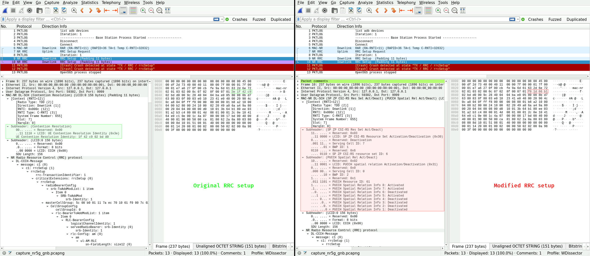
</details>

## Vulnerability V2: invalid monitoringSymbolsWithinSlot ([CVE-2025-31718](https://www.cve.org/CVERecord?id=CVE-2025-31718))

Triggering vulnerability V2 results in the following adb log entry:

```
NR_CTRL_SLOT_TASK Task  PHY CP assert in file nr_sym_buf_v2.c line 351 exp=0 info=[pdcerrinfo:0x19,pdc_trig_type:0x00000000, sbuf(0x10051006,0x10071008,0x1009100a,0x100b100c,0x100d1100,0x11011102,0x11031104,0x11051106,0x11071108),curslot:0x1
```

Note: this message is logged without a closing bracket.

To reproduce this issue, starting from the MAC-NR layer, change the byte at offset 51 of a valid RRC setup message to `{0x5b}` (as shown in figure 2). According to Wireshark, this corresponds to changing the value of the `monitoringSymbolsWithinSlot` field inside the RRC payload to `{0x82, 0xd8}`.

<details open>
<summary>Figure 2: Comparison of the original and modified RRC setup message for vulnerability V2 in Wireshark.</summary>
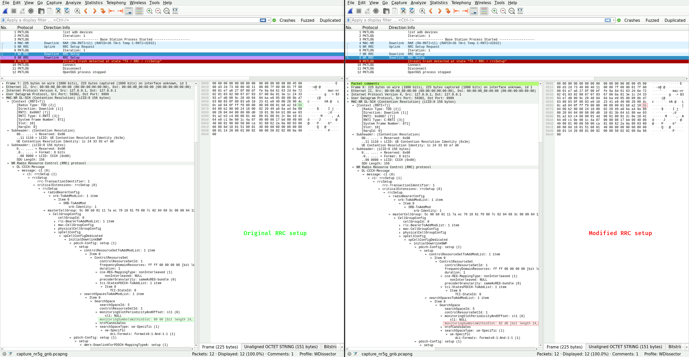
</details>

Note: the payload that triggers vulnerability V2 is identical to [CVE-2023-32841](https://www.cve.org/CVERecord?id=CVE-2023-32841), which affects another baseband vendor.

## Vulnerability V3: truncated srs-Config setup ([CVE-2025-11131](https://www.cve.org/CVERecord?id=CVE-2025-11131))

Triggering vulnerability V3 results in the following adb log entry:

```
NRRC Task  PS CP assert in file threadx_assert.c line 7586 exp=Abort exception handler ! info=[], [dfs=5], [abort_pc=0x93179066 abort_r13=0x97234660 DFSR=0xd FAR=0xb3f6e863 svc_r13=0x947cc8d0 irq_r13=0x9723ee38]
```

To reproduce this issue, starting from the MAC-NR layer, change the byte at offset 106 of a valid RRC setup message to the value `{0xe0}` (as shown in figure 3). According to Wireshark, this corresponds to changing the first two bytes of the `srs-Config setup` field inside the RRC payload to `{0x9c, 0x00}`.

<details open>
<summary>Figure 3: Comparison of the original and modified RRC setup message for vulnerability V3 in Wireshark.</summary>
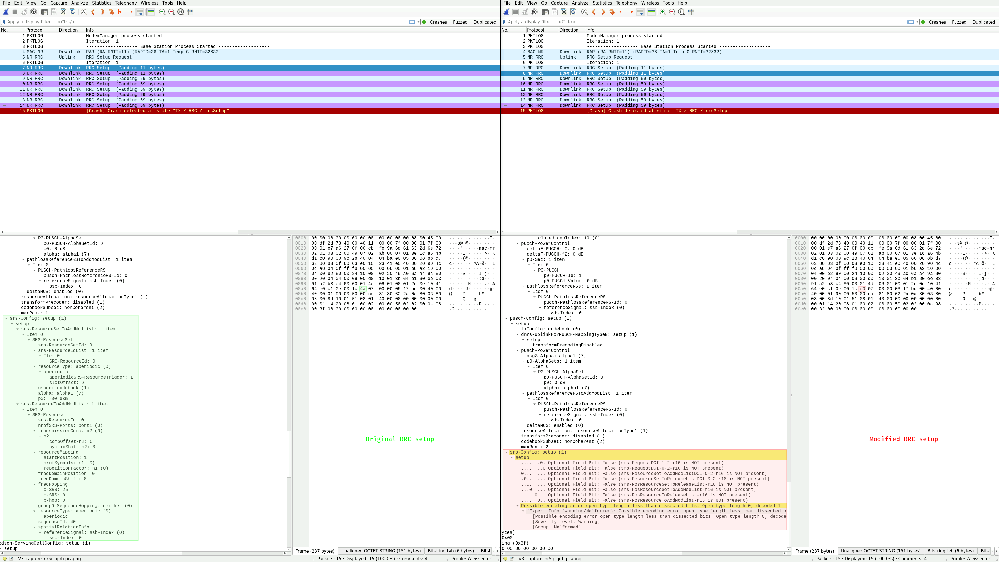
</details>

## Vulnerability V4: invalid nzp-CSI-RS-ResourceToAddModList 1 ([CVE-2025-11132](https://www.cve.org/CVERecord?id=CVE-2025-11132))

Triggering vulnerability V4 may result in the following adb log entry:

```
NR_DL_SLOT_LOW_TASK Task  PHY CP assert in file nr_sym_buf_v2.c line 377 exp=0 info=[csierrinfo:0xd,sbuf(0x10021003,0x11001101,0x11021103,0x11041105,0x11061107,0x11080000,0x10002,0x30004,0x50006),curslot:0x0,0x0], [dfs=5], [abort_pc=0 abort_
```

Note: this message is logged without a closing bracket.

To reproduce this issue, starting from the MAC-NR layer, change the byte at offset 134 of a valid RRC setup message to any of the following values: `{0x15}`, `{0x67}` or `{0xa9}` (this list is not exhaustive), e.g. `{0x15}` (as shown in figure 4). According to Wireshark, this corresponds to changing the 4th byte of the `nzp-CSI-RS-ResourceToAddModList` field inside the RRC payload, e.g. to `{0x02}`. This in turn changes the therein contained `frequencyDomainAllocation`, `nrofPorts` and `firstOFDMSymbolInTimeDomain` fields to invalid values.

<details open>
<summary>Figure 4: Comparison of the original and modified RRC setup message for vulnerability V4 in Wireshark.</summary>
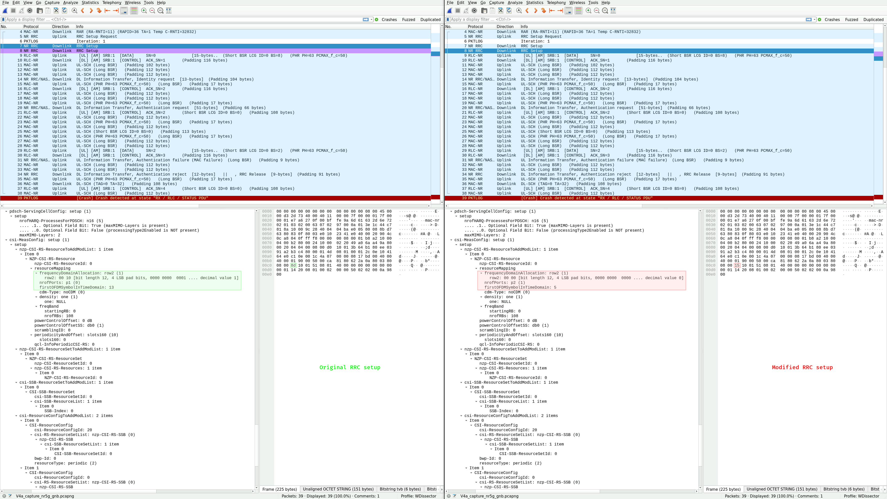
</details>

Alternatively, change the byte at offset 135 of a valid RRC setup message to any of the following values: `{0x30}`, `{0x74}` or `{0x93}` (this list is not exhaustive), e.g. `{0x30}`. According to Wireshark, this corresponds to changing the 5th byte of the `nzp-CSI-RS-ResourceToAddModList` field inside the RRC payload, e.g. to `{0xa6}`. This in turn changes the therein contained `density` field to an invalid value.

Note: in addition to the given adb log entry, this reachable assertion may occur in any of the following tasks:

* `NR_CSI_URGENT_CFG_TASK`
* `NR_CTRL_SLOT_TASK`
* `NR_DCI_SCHEDULE_TASK`
* `NR_DL_SLOT_LOW_TASK`
* `NR_DL_SLOT_TASK`
* `NR_EH_TASK`
* `NR_PAL_L_TASK`
* `NR_RRM_RLM_POST_TASK`
* `NR_SLOT_BG_TASK`
* `NR_SLOT_BG_SEC_TASK`
* `NR_SYNC_TASK`
* (task identifier empty)

## Vulnerability V5: invalid nzp-CSI-RS-ResourceToAddModList 2 ([CVE-2025-11133](https://www.cve.org/CVERecord?id=CVE-2025-11133))

Triggering vulnerability V5 results in the following adb log entry:

```
NRRC Task  PS CP assert in file nrrc_main.c line 5999 exp=(0) info=[NRRC: wait_for_nrcp_cnf_timer TIMER OUT, msg_id=8], [dfs=5], [abort_pc=0 abort_r13=0 DFSR=0 FAR=0 svc_r13=0 irq_r13=0]
```

To reproduce this issue, starting from the MAC-NR layer, change the byte at offset 134 of a valid RRC setup message to any of the following values: `{0x04}`, `{0x06}` or `{0x0b}`, e.g. `{0x04}` (as shown in figure 5). According to Wireshark, this corresponds to changing the 4th and 5th byte of the `nzp-CSI-RS-ResourceToAddModList` field inside the RRC payload, e.g. to `{0x00, 0x82}`. This in turn changes the therein contained `frequencyDomainAllocation` and `firstOFDMSymbolInTimeDomain` fields to invalid values.

<details open>
<summary>Figure 5: Comparison of the original and modified RRC setup message for vulnerability V5 in Wireshark.</summary>
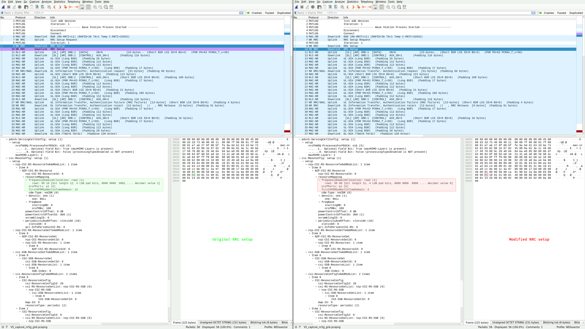
</details>

Note: triggering this vulnerability may require several (up to 5) connection attempts with modified RRC setup messages until one of them succeeds. In some cases, sending such RRC setup messages also results in one of the following adb log entries:

```
NR_CTRL_SLOT_TASK Task  PHY CP assert in file threadx_assert.c line 7586 exp=Abort exception handler ! info=[], [dfs=5], [abort_pc=0x97bacefe abort_r13=0xa15136d0 DFSR=0x406 FAR=0xd1f4ff5d svc_r13=0x9dc43688 irq_r13=0x410c41fc]
NR_SLOT_BG_TASK Task  PHY CP assert in file nr_sync_meas_schedule.c line 1572 exp=(cs_idx NEQ 0xFFFF) info=[NR_SYNC_SchGenNcsReg reg_idx:65535,card0_cnt:34,card0_isr:4,card1_cfg:0,card1_isr:0], [dfs=5], [abort_pc=0 abort_r13=0 DFSR=0 FAR=0 s
```

Note: the last message is logged without a closing bracket.

## Vulnerability V6: truncated masterCellGroup ([CVE-2025-3012](https://www.cve.org/CVERecord?id=CVE-2025-3012))

Triggering vulnerability V6 results in the following adb log entry:

```
ngrant_sig_task PS CP assert in file threadx_assert.c line 7586 exp=Abort exception handler ! info=[], [dfs=5], [abort_pc=0x92e58782 abort_r13=0x97234660 DFSR=0x80d FAR=0xe59ff018 svc_r13=0x94a28fc8 irq_r13=0x9723ee38]
```

To reproduce this issue, starting from the MAC-NR layer, change the byte at offset 15 of a valid RRC setup message to the value `{0x0c}` (as shown in figure 6). According to Wireshark, this corresponds to changing the 2nd and 3rd byte of the `masterCellGroup` field inside the RRC payload to `{0x01, 0x90}`.

<details open>
<summary>Figure 6: Comparison of the original and modified RRC setup message for vulnerability V6 in Wireshark.</summary>
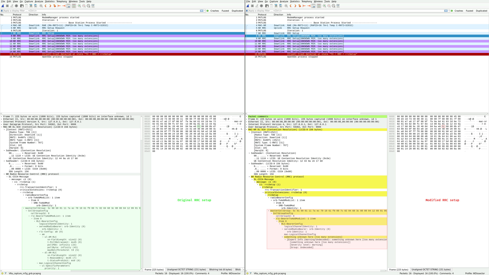
</details>

Note: this vulnerability can also be triggered by changing the byte at offset 22 of a valid RRC setup message to any of the following values: `{0x3e}`, `{0x50}` or `{0x7a}` (this list is not exhaustive).

## Vulnerability V7: invalid pucch-CSI-ResourceList ([CVE-2025-61617](https://www.cve.org/CVERecord?id=CVE-2025-61617))

Triggering vulnerability V7 results in the following adb log entry:

```
NR_PAL_L_TASK Task  PHY CP assert in file nr_ul_control.c line 4764 exp=NULL NEQ (puc_slot_config->puc_cfg[0].puc_resouce) info=[multi csi first resource ptr invalid], [dfs=7], [abort_pc=0 abort_r13=0 DFSR=0 FAR=0 svc_r13=0 irq_r13=0]
```

To reproduce this issue, starting from the MAC-NR layer, change the following bytes at the respective offsets of a valid RRC setup message (as shown in figure 7):

| Offset | Value |
| ------ | ----- |
| 153    | 0x3c  |
| 154    | 0x48  |
| 155    | 0x03  |
| 158    | 0x00  |
| 160    | 0x00  |
| 161    | 0x41  |
| 162    | 0x00  |
| 163    | 0x03  |

According to Wireshark, this corresponds to changing several bytes of the `csi-ResourceConfigToAddModList` and `csi-ReportConfigToAddModList` fields inside the RRC payload to invalid values and notably affects the `pucch-CSI-ResourceList` field contained in the latter.

<details open>
<summary>Figure 7: Comparison of the original and modified RRC setup message for vulnerability V7 in Wireshark.</summary>
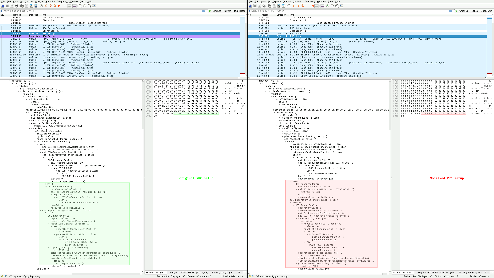
</details>

## Vulnerability V8: truncated spCellConfig ([CVE-2025-61618](https://www.cve.org/CVERecord?id=CVE-2025-61618))

Triggering vulnerability V8 results in the following adb log entry:

```
NR_PS_TO_PHY_TASK Task  PHY CP assert in file nr_fsm_handle.c line 12999 exp=0 info=[PAL:ASSERT:bwpIdx is not found.1], [dfs=5], [abort_pc=0 abort_r13=0 DFSR=0 FAR=0 svc_r13=0 irq_r13=0]
```

Note: this is similar to vulnerability V1 from our previous report, but occurs in a different task (`NR_PS_TO_PHY_TASK` instead of `NR_PAL_L_TASK`).

To reproduce this issue, starting from the MAC-NR layer, change the byte at offset 34 of a valid RRC setup message to the value `{0x83}` (as shown in figure 8). According to Wireshark, this corresponds to changing the 2nd and 3rd byte of the `spCellConfig` field inside the RRC payload to `{0x10, 0x69}`. Notably, this truncation affects the `bwp-Id` field in the `tci-StatesToAddModList`, `csi-ResourceConfigToAddModList` and `CSI-ResourceConfig` fields.

<details open>
<summary>Figure 8: Comparison of the original and modified RRC setup message for vulnerability V8 in Wireshark.</summary>
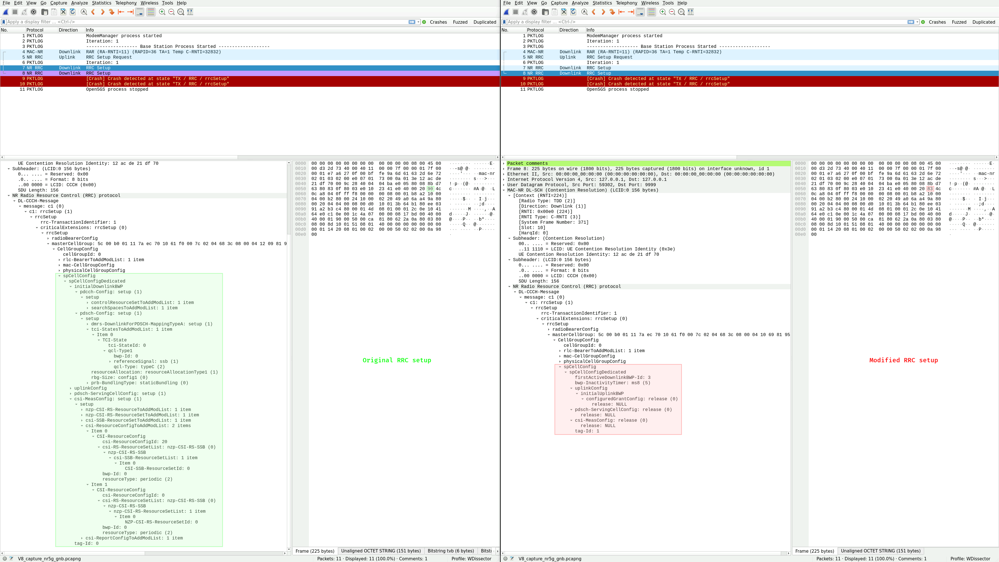
</details>

## Vulnerability V9: invalid pdcch-Config controlResourceSetId ([CVE-2025-61619](https://www.cve.org/CVERecord?id=CVE-2025-61619))

Triggering vulnerability V9 results in the following adb log entry:

```
NR_PS_TO_PHY_TASK Task  PHY CP assert in file threadx_assert.c line 7586 exp=Abort exception handler ! info=[], [dfs=5], [abort_pc=0x97c286b8 abort_r13=0xa15136d0 DFSR=0x406 FAR=0xf1e4ff7d svc_r13=0x9dc71274 irq_r13=0x410c42c0]
```

To reproduce this issue, starting from the MAC-NR layer, change the byte at offset 39 of a valid RRC setup message to any value in the range `{0x10}` to `{0x5f}`, e.g. `{0x57}` (as shown in figure 9). According to Wireshark, this corresponds to changing the 2nd byte of the `pdcch-Config controlResourceSetToAddModList` field inside the RRC payload, e.g. to `{0x8a}`. This in turn changes the value of the corresponding `controlResourceSetId`, e.g. to `{0xa}`.

<details open>
<summary>Figure 9: Comparison of the original and modified RRC setup message for vulnerability V9 in Wireshark.</summary>
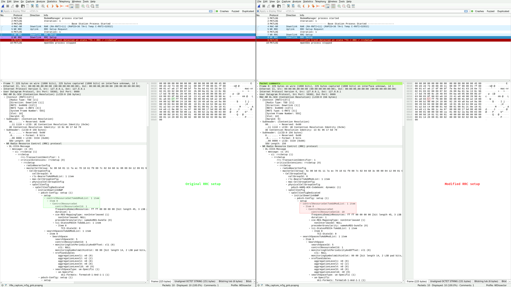
</details>

Note: this vulnerability can also be triggered by changing the byte at offset 49 of a valid RRC setup message to the value `{0x84}` or any value in the range `{0x89}` to `{0x97}`, e.g. `{0x84}`. According to Wireshark, this corresponds to changing the 2nd and 3rd byte of the `pdcch-Config searchSpacesToAddModList` field inside the RRC payload, e.g. to `{0x10, 0x82}`. This in turn changes the value of the corresponding `controlResourceSetId`, e.g. to `{0x2}`.

## Vulnerability V10: invalid pucch-Config resourceId ([CVE-2025-61607](https://www.cve.org/CVERecord?id=CVE-2025-61607))

Triggering vulnerability V10 results in the following adb log entry:

```
NR_PAL_L_TASK Task  PHY CP assert in file threadx_assert.c line 7586 exp=Abort exception handler ! info=[], [dfs=5], [abort_pc=0x4108b5e0 abort_r13=0xa15136d0 DFSR=0x406 FAR=0xe1f17f5f svc_r13=0x9dc534f8 irq_r13=0x410c42c0]
```

To reproduce this issue, starting from the MAC-NR layer, change the byte at offset 76 of a valid RRC setup message to any value in the range `{0x00}` to `{0x04}`, e.g. `{0x00}` (as shown in figure 10). According to Wireshark, this corresponds to changing the 5th byte of the `pucch-Config resourceToAddModList` field inside the RRC payload, e.g. to `{0x00}`. This in turn changes the value of the corresponding `pucch-ResourceId`, e.g. to `{0x00}`.

<details open>
<summary>Figure 10: Comparison of the original and modified RRC setup message for vulnerability V10 in Wireshark.</summary>
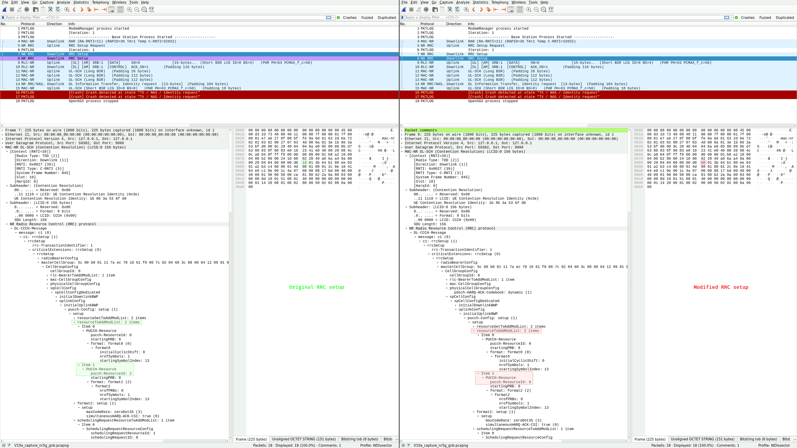
</details>

Note: this vulnerability can also be triggered by modifying a valid RRC setup message at multiple offsets, starting from the MAC-NR layer, as follows:

| Offset | Value |
| ------ | ----- |
| 9      | 0x30  |
| 70     | 0x22  |
| 73     | 0x09  |
| 160    | 0x04  |
| 161    | 0x40  |

According to Wireshark, this changes multiple fields in the RRC setup message, notably the `pucch-ResourceId` of the `resourceSetToAddModList`. The resulting modem assert occurs either in the `NR_PAL_L_TASK` or in the `NR_DCI_SCHEDULE_TASK`:

```
NR_PAL_L_TASK Task  PHY CP assert in file threadx_assert.c line 7586 exp=Abort exception handler ! info=[], [dfs=5], [abort_pc=0x4108b5e0 abort_r13=0xa15136d0 DFSR=0x406 FAR=0xe1f47f5d svc_r13=0x9dc534f8 irq_r13=0x410c42c0]
NR_DCI_SCHEDULE_TASK Task  PHY CP assert in file threadx_assert.c line 7586 exp=Abort exception handler ! info=[], [dfs=7], [abort_pc=0x4108b60e abort_r13=0xa15136d0 DFSR=0x406 FAR=0xe9e5ff5d svc_r13=0x9dc331c0 irq_r13=0x410c42c0]
```

## Vulnerability V11: invalid srs-ResourceToAddModList ([CVE-2025-61608](https://www.cve.org/CVERecord?id=CVE-2025-61608))

Triggering vulnerability V11 results in the following adb log entry:

```
NR_PS_TO_PHY_TASK Task  PHY CP assert in file nr_fsm_handle.c line 12192 exp=0 info=[PAL:ASSERT:resourceMapping.startPosition 0  is less than num_of_symb 1], [dfs=5], [abort_pc=0 abort_r13=0 DFSR=0 FAR=0 svc_r13=0 irq_r13=0]
```

To reproduce this issue, starting from the MAC-NR layer, change the byte at offset 116 of a valid RRC setup message to any value in the range `{0x10}` to `{0x12}` (this list is not exhaustive), e.g. `{0x10}` (as shown in figure 11). According to Wireshark, this corresponds to changing the 3rd byte of the `srs-ResourceToAddModList` field inside the RRC payload, e.g. to `{0x02}`. This in turn causes a mismatch between the values of the `startPosition` and `nrofSymbols` fields contained therein.

<details open>
<summary>Figure 11: Comparison of the original and modified RRC setup message for vulnerability V11 in Wireshark.</summary>
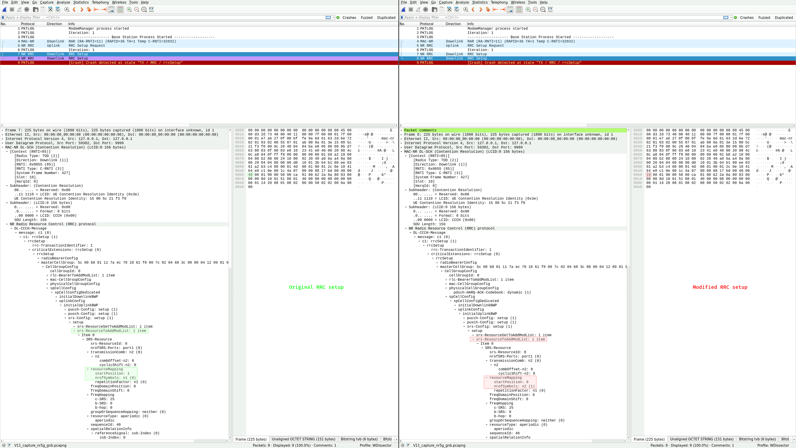
</details>

## Vulnerability V12: truncated csi-MeasConfig setup ([CVE-2025-61609](https://www.cve.org/CVERecord?id=CVE-2025-61609))

Triggering vulnerability V12 results in the following adb log entry:

```
NR_PAL_L_TASK Task  PHY CP assert in file nr_pucch_csi.c line 588 exp=0 info=[], [dfs=5], [abort_pc=0 abort_r13=0 DFSR=0 FAR=0 svc_r13=0 irq_r13=0]
```

To reproduce this issue, starting from the MAC-NR layer, change the byte at offset 144 of a valid RRC setup message to the value `{0x4e}` (as shown in figure 12). According to Wireshark, this corresponds to changing the 2nd and 3rd byte of the `nzp-CSI-RS-ResourceSetToAddModList` field inside the RRC payload to `{0x09, 0xc0}`. Depending on the original RRC setup message, this may result in an invalid `nzp-CSI-RS-ResourceSetToAddModList` and `csi-SSB-ResourceSetToAddModList`. In addition, this leads to a truncation of the remaining `csi-MeasConfig setup` field.

<details open>
<summary>Figure 12: Comparison of the original and modified RRC setup message for vulnerability V12 in Wireshark.</summary>
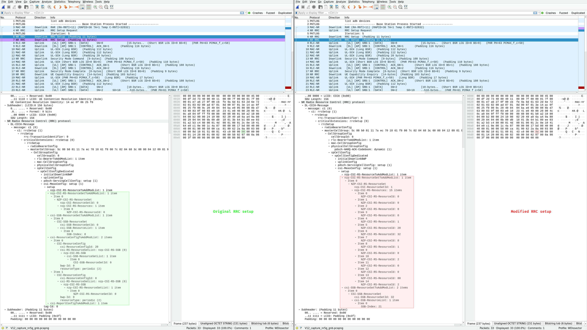
</details>

Note: triggering this vulnerability may require several (up to 20) connection attempts with modified RRC setup messages until one of them succeeds, thereby making its exploitation rather unstable. In addition, the modem reset occurs only after the UE subsequently attaches to the network.

## Vulnerability V13: invalid pdsch-ServingCellConfig ([CVE-2025-61610](https://www.cve.org/CVERecord?id=CVE-2025-61610))

Triggering vulnerability V13 results in the following adb log entry:

```
NR_DCI_SCHEDULE_TASK Task  PHY CP assert in file nr_pdsch.c line 2274 exp=0 info=[g_pdsch_watchDog error. 1], [dfs=5], [abort_pc=0 abort_r13=0 DFSR=0 FAR=0 svc_r13=0 irq_r13=0]
```

To reproduce this issue, starting from the MAC-NR layer, change the byte at offset 123 of a valid RRC setup message to any of the following values: `{0xa2}`, `{0xa3}` or `{0xa6}` (this list is not exhaustive), e.g. `{0xa2}` (as shown in figure 13). According to Wireshark, this corresponds to changing the `pdsch-ServingCellConfig` field inside the RRC payload to an invalid value.

<details open>
<summary>Figure 13: Comparison of the original and modified RRC setup message for vulnerability V13 in Wireshark.</summary>
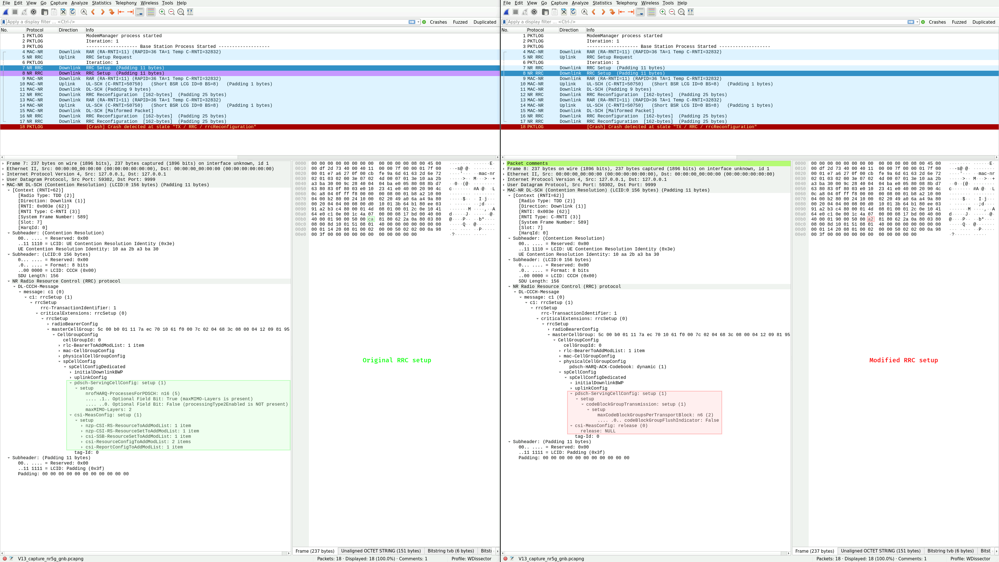
</details>

## Vulnerability V14: truncated CellGroupConfig ([CVE-2025-61612](https://www.cve.org/CVERecord?id=CVE-2025-61612))

Triggering vulnerability V14 results in the following adb log entry:

```
ngrant_sig_task PS CP assert in file PS/stack/common/lte_nr/src/wrp/wrp_buffer_pool.c line 596 exp=0 info=[Freeing a previously freed buffer], [dfs=5], [abort_pc=0 abort_r13=0 DFSR=0 FAR=0 svc_r13=0 irq_r13=0]
```

To reproduce this issue, starting from the MAC-NR layer, choose one of the following variants (A-E) and change the bytes at the respective offsets of a valid RRC setup message (a dash means no change):

| Offset | Variant A | Variant B | Variant C | Variant D | Variant E |
| ------ | --------- | --------- | --------- | --------- | --------- |
| 10     | -         | -         | -         | -         | 0xec      |
| 11     | -         | -         | -         | 0xa2      | 0x40      |
| 12     | -         | -         | -         | 0x03      | 0x97      |
| 13     | 0xa0      | 0x0c      | 0x50      | 0x7c      | -         |
| 14     | 0x00      | 0x08      | 0x20      | 0x51      | -         |

According to Wireshark and by example of variant A (as shown in figure 14), this corresponds to changing the first byte inside the RRC payload to `{0x00}` and subsequently leads to a truncation of the `CellGroupConfig` field.

<details open>
<summary>Figure 14: Comparison of the original and modified RRC setup message for vulnerability V14 in Wireshark.</summary>
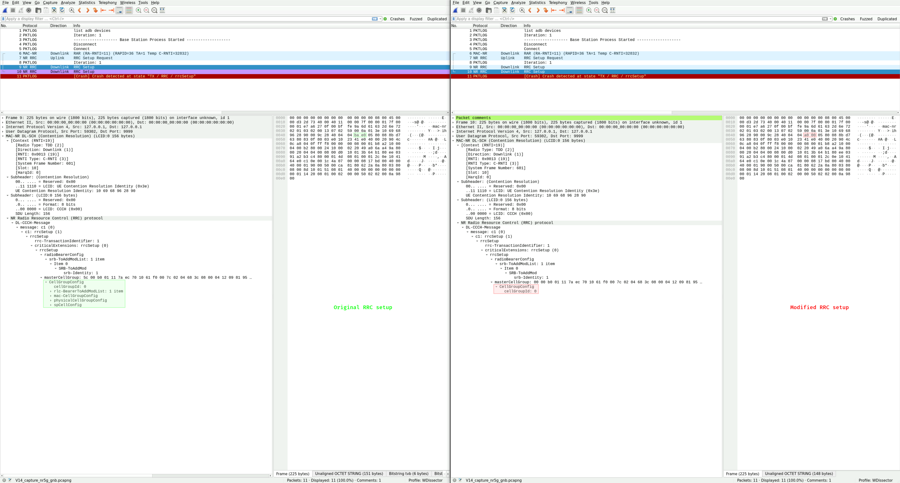
</details>

## Vulnerability V15: invalid controlResourceSetToAddModList ([CVE-2025-61613](https://www.cve.org/CVERecord?id=CVE-2025-61613))

Triggering vulnerability V15 results in the following adb log entry:

```
NR_PS_TO_PHY_TASK Task  PHY CP assert in file nr_pdcch_protocol.c line 263 exp=0 info=[coreset0 freq_bitmap all 0], [dfs=5], [abort_pc=0 abort_r13=0 DFSR=0 FAR=0 svc_r13=0 irq_r13=0]
```

To reproduce this issue, starting from the MAC-NR layer, choose one of the following variants (A-C) and change the bytes at the respective offsets of a valid RRC setup message:

| Offset | Variant A | Variant B | Variant C |
| ------ | --------- | --------- | --------- |
| 37     | 0xe1      | 0xe5      | 0xb0      |
| 38     | 0x2c      | 0x2c      | 0x6d      |

According to Wireshark and by example of variant A (as shown in figure 15), this modification corresponds to changing the 23rd and 24th byte inside the RRC payload to `{0x9c, 0x25}`. This in turn alters the `controlResourceSetToAddModList` contained in the `pdcch-Config setup` field and changes its contents to invalid values.

<details open>
<summary>Figure 15: Comparison of the original and modified RRC setup message for vulnerability V15 in Wireshark.</summary>
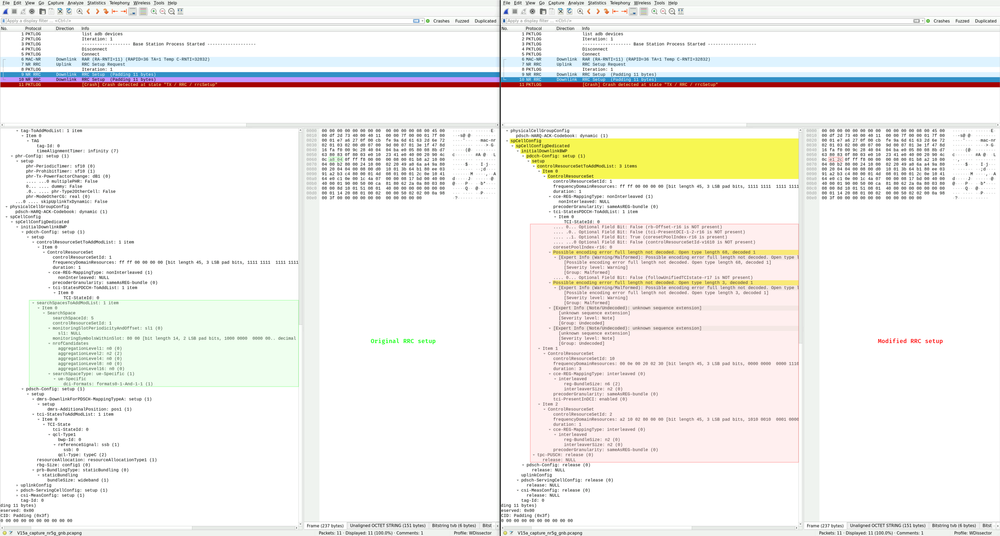
</details>

## Vulnerability V16: truncated CellGroupConfig and spCellConfig ([CVE-2025-61614](https://www.cve.org/CVERecord?id=CVE-2025-61614))

Triggering vulnerability V16 results in the following adb log entry:

```
NR_L2_ULHARQ_TASK Task  PS CP assert in file nr_mac_tx.c line 11924 exp=tag_id < NR_MAX_NR_OF_TAGS info=[], [dfs=6], [abort_pc=0 abort_r13=0 DFSR=0 FAR=0 svc_r13=0 irq_r13=0]
```

To reproduce this issue, starting from the MAC-NR layer, change the following bytes at the respective offsets of a valid RRC setup message (as shown in figure 16):

| Offset | Value |
| ------ | ----- |
| 13     | 0x50  |
| 14     | 0x20  |
| 15     | 0xa2  |

According to Wireshark, this corresponds to changing the first three bytes inside the RRC payload to `{0x04, 0x14, 0x50}` and subsequently leads to a truncation of the `CellGroupConfig` and `spCellConfig` fields.

<details open>
<summary>Figure 16: Comparison of the original and modified RRC setup message for vulnerability V16 in Wireshark.</summary>
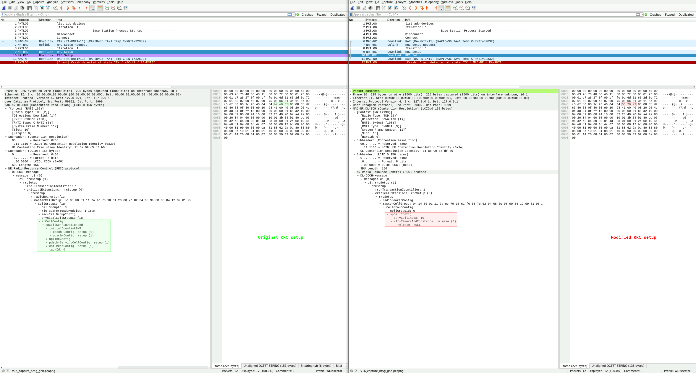
</details>

## Vulnerability V17: invalid uplinkConfig ([CVE-2025-61615](https://www.cve.org/CVERecord?id=CVE-2025-61615))

Triggering vulnerability V17 results in the following adb log entry:

```
DRM_SPR_RF Task  PHY CP assert in file drm_rfresourcehandle.c line 5103 exp=((ul_bw !=0) && (ul_bw <= DRM_RF_BW_100MHZ)) info=[Drm_RfResHandle_CalcNrTxOsr: ul bw error 0], [dfs=7], [abort_pc=0 abort_r13=0 DFSR=0 FAR=0 svc_r13=0 irq_r13=0]
```

To reproduce this issue, starting from the MAC-NR layer, change the following bytes at the respective offsets of a valid RRC setup message (as shown in figure 17):

| Offset | Value |
| ------ | ----- |
| 62     | 0xc4  |
| 63     | 0x9c  |
| 64     | 0x25  |

According to Wireshark, this corresponds to changing the 48th to 51st byte inside the RRC payload to `{0x18, 0x93, 0x84, 0xb4}`. This in turn alters the `uplinkConfig` field and changes its contents, notably its uplink bandwidth properties, to invalid values.

<details open>
<summary>Figure 17: Comparison of the original and modified RRC setup message for vulnerability V17 in Wireshark.</summary>
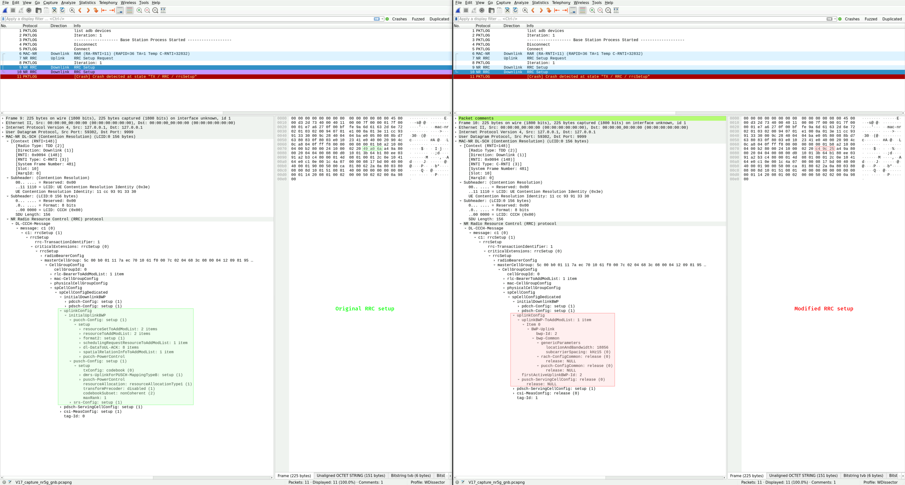
</details>

## Vulnerability V18: invalid pdsch-ServingCellConfig setup ([CVE-2025-61616](https://www.cve.org/CVERecord?id=CVE-2025-61616))

Triggering vulnerability V18 results in the following adb log entry:

```
NR_DCI_SCHEDULE_TASK Task  PHY CP assert in file nr_fec.c line 1389 exp=0 info=[pdsch demod ASIC error], [dfs=7], [abort_pc=0 abort_r13=0 DFSR=0 FAR=0 svc_r13=0 irq_r13=0]
```

To reproduce this issue, starting from the MAC-NR layer, change the following bytes at the respective offsets of a valid RRC setup message (as shown in figure 18):

| Offset | Value |
| ------ | ----- |
| 123    | 0xa7  |
| 124    | 0xca  |
| 125    | 0x2c  |

According to Wireshark, this corresponds to changing the 109th to 112th byte inside the RRC payload to `{0x14, 0xf9, 0x45, 0x8c}`. This in turn alters the `ServingCellConfig setup` field and changes its contents to invalid values.

<details open>
<summary>Figure 18: Comparison of the original and modified RRC setup message for vulnerability V18 in Wireshark.</summary>
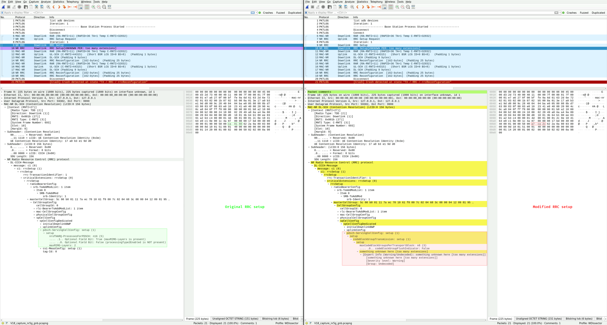
</details>

Note: most of the time, triggering this vulnerability results in the following error message of the PDSCH watchdog, which is suspected to mask the underlying bug:

```
NR_DCI_SCHEDULE_TASK Task  PHY CP assert in file nr_pdsch.c line 2274 exp=0 info=[g_pdsch_watchDog error. 1], [dfs=5], [abort_pc=0 abort_r13=0 DFSR=0 FAR=0 svc_r13=0 irq_r13=0]
```

## Vulnerability V19: invalid spCellConfig pdcch-Config setup ([CVE-2025-69278](https://www.cve.org/CVERecord?id=CVE-2025-69278))

Triggering vulnerability V19 results in the following adb log entry:

```
NRRC Task  PS CP assert in file threadx_assert.c line 7586 exp=Abort exception handler ! info=[], [dfs=5], [abort_pc=0x931790d2 abort_r13=0x97234660 DFSR=0xd FAR=0xb3f6e37d svc_r13=0x947cc8d0 irq_r13=0x9723ee38]
```

To reproduce this issue, starting from the MAC-NR layer, change the following bytes at the respective offsets of a valid RRC setup message (as shown in figure 19):

| Offset | Value |
| ------ | ----- |
| 35     | 0xb0  |
| 36     | 0xdd  |
| 37     | 0xbb  |

According to Wireshark, this corresponds to changing the 21st to 24th byte inside the RRC payload to `{0x16, 0x1b, 0xb7, 0x60}`. This in turn alters the `pdcch-Config setup` field inside the `spCellConfig` field and changes its contents to invalid values. Moreover, it leads to a truncation of the remaining fields in the RRC setup message.

<details open>
<summary>Figure 19: Comparison of the original and modified RRC setup message for vulnerability V19 in Wireshark.</summary>
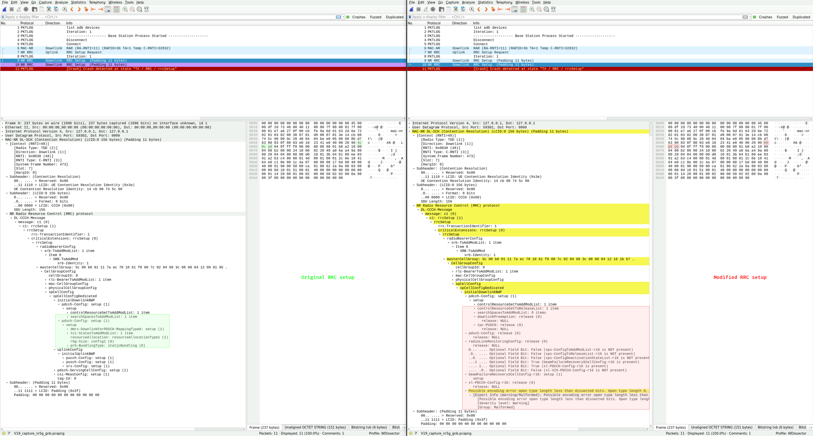
</details>

## Vulnerability V20: invalid spCellConfig pdsch-Config setup ([CVE-2025-69279](https://www.cve.org/CVERecord?id=CVE-2025-69279))

Triggering vulnerability V20 results in any of the following adb log entries (note that the program counter `abort_pc` differs slightly):

```
NR_DCI_SCHEDULE_TASK Task  PHY CP assert in file threadx_assert.c line 7586 exp=Abort exception handler ! info=[], [dfs=5], [abort_pc=0x4104a1f0 abort_r13=0xa15136d0 DFSR=0x406 FAR=0x81f07f5d svc_r13=0x9dc33448 irq_r13=0x410c42c0]
NR_DCI_SCHEDULE_TASK Task  PHY CP assert in file threadx_assert.c line 7586 exp=Abort exception handler ! info=[], [dfs=6], [abort_pc=0x4104a1f8 abort_r13=0xa15136d0 DFSR=0x406 FAR=0xa1e57f5f svc_r13=0x9dc33448 irq_r13=0x410c42c0]
NR_DCI_SCHEDULE_TASK Task  PHY CP assert in file threadx_assert.c line 7586 exp=Abort exception handler ! info=[], [dfs=5], [abort_pc=0x4104a200 abort_r13=0xa15136d0 DFSR=0x406 FAR=0xf1f5ff5d svc_r13=0x9dc33450 irq_r13=0x410c42c0]
```

To reproduce this issue, starting from the MAC-NR layer, choose one of the following variants (A-C) and change the bytes at the respective offsets of a valid RRC setup message (a dash means no change):

| Offset | Variant A | Variant B | Variant C |
| ------ | --------- | --------- | --------- |
| 54     | 0xbb      | -         | 0x98      |
| 55     | 0xb5      | 0x35      | 0x25      |
| 56     | -         | 0x68      | 0xa3      |
| 57     | -         | 0x18      | 0xac      |
| 58     | -         | 0x0d      | 0x1b      |
| 59     | -         | -         | 0x9e      |

According to Wireshark and by example of variant A (as shown in figure 20), this modification corresponds to changing the 40th to 42nd byte inside the RRC payload to `{0x17, 0x76, 0xa0}`. This in turn alters the `pdsch-Config setup` field inside the `spCellConfig` field and changes its contents to invalid values. Moreover, it leads to a truncation of the remaining fields in the RRC setup message.

<details open>
<summary>Figure 20: Comparison of the original and modified RRC setup message for vulnerability V20 in Wireshark.</summary>
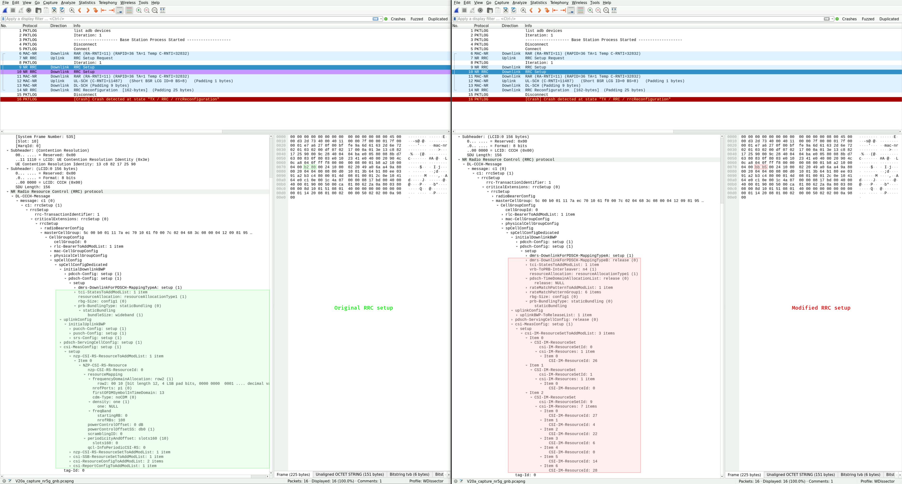
</details>

## Affected Product and Firmware

The following product and firmware were tested and found to be affected by the vulnerabilities:

* Smartphone: Motorola Moto G35 5G (Unisoc Tanggula T760/T8100 with integrated 5G baseband)
* Firmware: Android 14, Build: `UOA34.216-174-12`, Patch level: 2025-04-05, Baseband version: `5G_MODEM_V2_23B_W24.33.5_P16.1` (older versions may also be affected)

SHA-256 hash of the affected baseband firmware images (bundled by Motorola):
```
ffc8ece7229e30cc530d45fa1257c63c57370e6e36503aa39b315f8f7eede126  SC9600_QogirN6Pro_PHY_SECU_modem.bin
532021ad7e95ae7849529e04cf9517c8020ee8d4d2799aa648d7266613b9995d  SC9600_QogirN6Pro_PS_SECU_Customer_modem.bin
```

## Solution

Unisoc publicly disclosed the vulnerabilities V1 - V2 as part of their [October 2025 Security Bulletin](https://www.unisoc.com/en/support/announcement/1976557615080263681). Moreover, Unisoc stated that they have released updated baseband firmware which fixes these vulnerabilities. According to Unisoc, the baseband firmware version `5G_MODEM_V2_23B_W24.26.4_P21` includes patches for the vulnerabilities V1 - V2.

Unisoc publicly disclosed the vulnerabilities V3 - V13 as part of their [December 2025 Security Bulletin](https://www.unisoc.com/en/support/announcement/1995394837938163714). Moreover, Unisoc stated that they have released updated baseband firmware which fixes these vulnerabilities. According to Unisoc, the baseband firmware version `5G_MODEM_V2_23B_W24.33.5_P18.2` includes patches for the vulnerabilities V3 - V13.

Unisoc publicly disclosed the vulnerabilities V14 - V20 as part of their [March 2026 Security Bulletin](https://www.unisoc.com/en/support/announcement/2030931350138310657). Moreover, Unisoc stated that they have released updated baseband firmware which fixes these vulnerabilities. According to Unisoc, the baseband firmware version `5G_MODEM_V2_23B_W24.32.6_P19.16` includes patches for the vulnerabilities V14 - V20.

## Communication Timeline

We submitted a total of three vulnerability reports to Unisoc. The corresponding communication timelines are listed below.

### Vulnerability Report 1 (Vulnerabilities V1 - V2)

| Date       | Sender       | Description |
| ---------- | ------------ | ----------- |
| 2025-06-18 | Denis Krämer | Contacted Unisoc using their PGP public key and attached the first vulnerability report. |
| 2025-06-19 | Unisoc       | Acknowledges receipt of the report and requests further information on the vulnerabilities. |
| 2025-06-19 | Denis Krämer | Provided the requested information to Unisoc. |
| 2025-07-24 | Unisoc       | Acknowledges the vulnerabilities as valid, plans to disclose them in October 2025. |
| 2025-07-24 | Unisoc       | Asks for the information to be published on their acknowledgements page. |
| 2025-07-29 | Unisoc       | Asks for the acknowledgement information again. |
| 2025-07-29 | Denis Krämer | Provided the information for the acknowledgements page. |
| 2025-07-29 | Unisoc       | Confirms receipt of the acknowledgement information. |
| 2025-10-11 | -            | Unisoc releases their October 2025 security bulletin (predated to 2025-10-01). |
| 2025-10-14 | Denis Krämer | Inquired about the mapping of vulnerabilities to CVE IDs, pointed out an inconsistency in the CVSS scores. |
| 2025-10-15 | Unisoc       | Clarifies the mapping and updates the CVSS scores. |
| 2025-11-04 | Denis Krämer | Asked which baseband firmware version fixes the vulnerabilities V1 - V2. |
| 2025-11-06 | Unisoc       | States that firmware version `5G_MODEM_V2_23B_W24.26.4_P21` fixes these issues. |

### Vulnerability Report 2 (Vulnerabilities V3 - V13)

| Date       | Sender       | Description |
| ---------- | ------------ | ----------- |
| 2025-07-28 | Denis Krämer | Contacted Unisoc using their PGP public key and attached the second vulnerability report. |
| 2025-07-29 | Unisoc       | Acknowledges receipt of the report and requests further information on the vulnerabilities. |
| 2025-07-29 | Denis Krämer | Provided the requested information to Unisoc. |
| 2025-07-30 | Unisoc       | Confirms receipt of the information. |
| 2025-08-05 | Unisoc       | Asks for further information regarding vulnerability V5. |
| 2025-08-05 | Denis Krämer | Provided the requested information to Unisoc. |
| 2025-08-26 | Unisoc       | Acknowledges the vulnerabilities as valid, plans to disclose them in November or December 2025. |
| 2025-12-01 | -            | Unisoc releases their December 2025 security bulletin. |
| 2025-12-01 | Unisoc       | Provides a mapping for the vulnerabilities to CVE IDs. |
| 2025-12-01 | Denis Krämer | Thanked for the information. Asked which baseband firmware version fixes the vulnerabilities V3 - V13. |
| 2025-12-02 | Unisoc       | States that firmware version `5G_MODEM_V2_23B_W24.33.5_P18.2` fixes these issues. |

### Vulnerability Report 3 (Vulnerabilities V14 - V20)

| Date       | Sender       | Description |
| ---------- | ------------ | ----------- |
| 2025-10-02 | Denis Krämer | Contacted Unisoc using their PGP public key and attached the third vulnerability report. |
| 2025-10-08 | Denis Krämer | Inquired whether Unisoc received the report. |
| 2025-10-10 | Unisoc       | Acknowledges receipt of the report, but the response suggests a possible mix-up. |
| 2025-10-10 | Denis Krämer | Inquired Unisoc about a possible mix-up. |
| 2025-10-11 | Unisoc       | Apologizes for the mix-up. |
| 2025-12-01 | Unisoc       | Acknowledges the vulnerabilities, plans to disclose them in March 2026. <br> Asks for the acknowledgement information. |
| 2025-12-01 | Denis Krämer | Provided the acknowledgement information. |
| 2026-03-09 | Denis Krämer | Inquired whether Unisoc still plans to disclose V14 – V20 in March 2026. <br> Asked which baseband firmware version fixes these vulnerabilities. |
| 2026-03-09 | Unisoc       | States that it will disclose V14 – V20 in March 2026 as planned. <br> States that firmware version `5G_MODEM_V2_23B_W24.32.6_P19.16` fixes these issues. |
| 2026-03-09 | -            | Unisoc releases their March 2026 security bulletin (predated to 2026-03-01). |

## Version History

| Date       | Version | Changes                                       |
| ---------- | ------- | --------------------------------------------- |
| 2025-11-25 | v1.0    | Initial release of vulnerabilities V1 - V2    |
| 2025-11-25 | v1.1    | Cosmetic changes                              |
| 2025-12-01 | v2.0    | Add disclosure of vulnerabilities V3 - V13    |
| 2025-12-02 | v2.1    | Include patch information for V3 - V13        |
| 2026-03-15 | v3.0    | Add disclosure of vulnerabilities V14 - V20   |